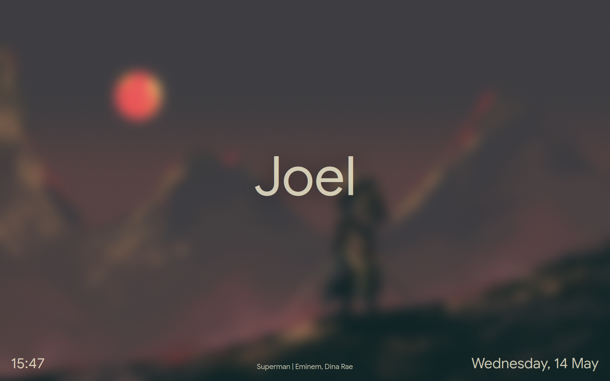
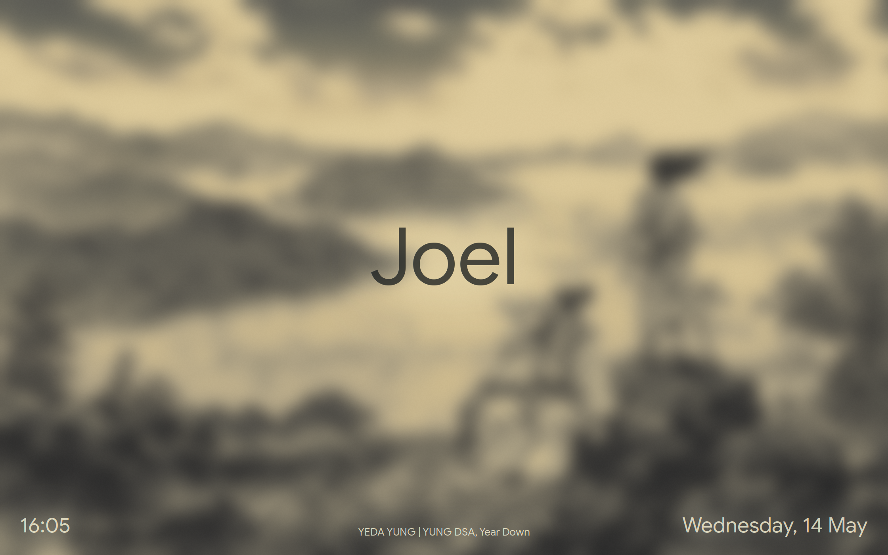
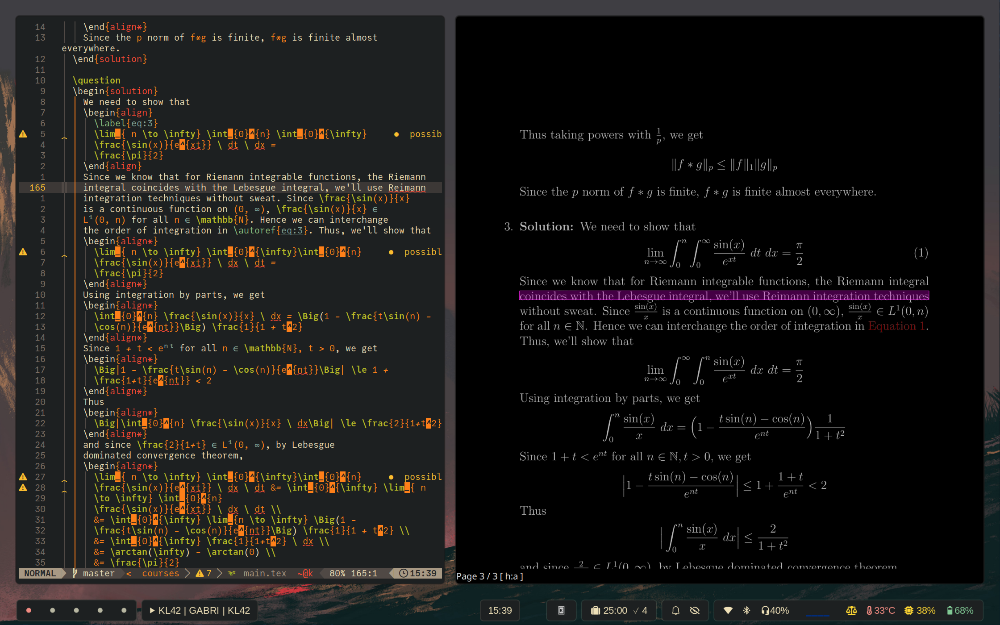
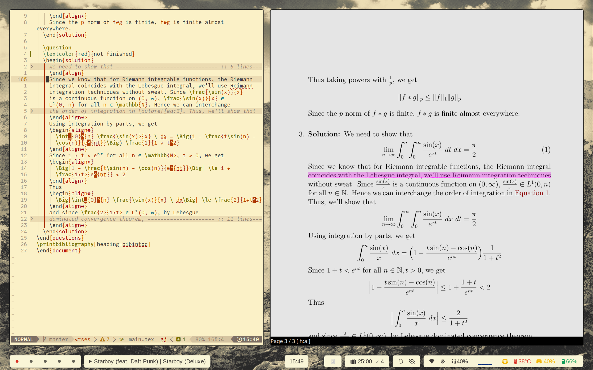
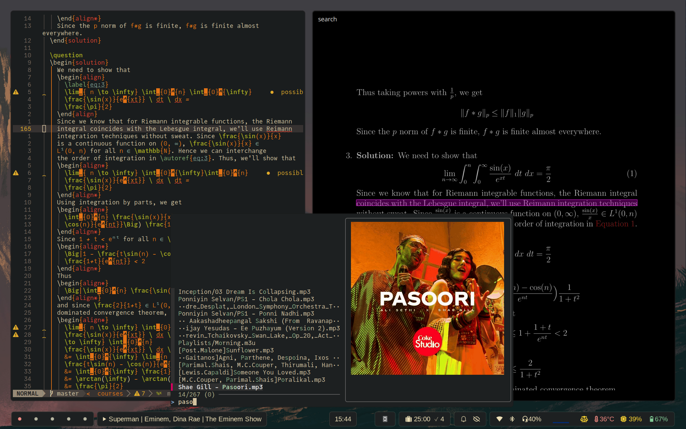
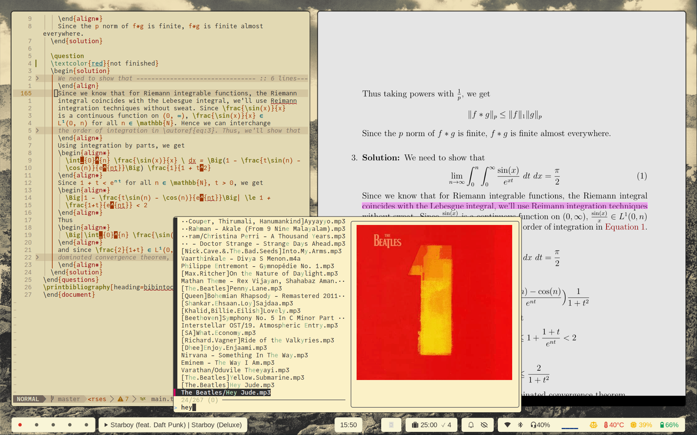
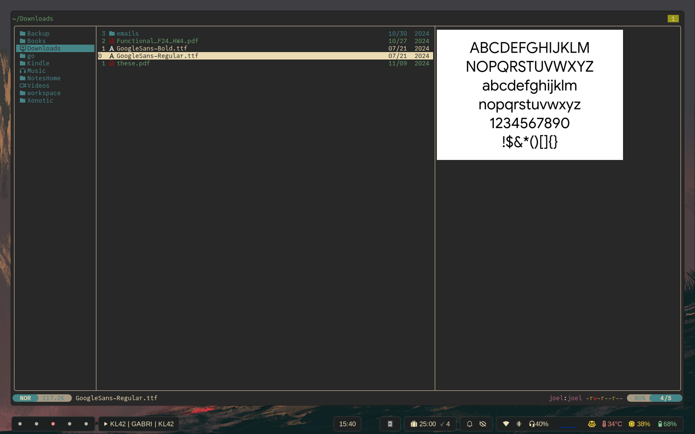
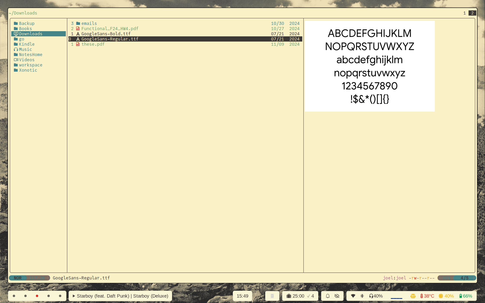
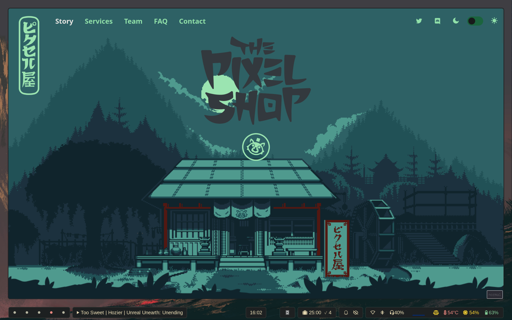
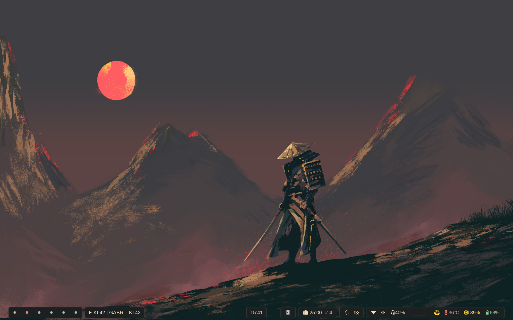

# My Configs

Here are the config files of various applications that I use.

# Application List

| Type | App|
|------|----|
|Window manager | Hyprland |
|Wallpaper Manager | Swaybg |
|Terminal | Foot |
|Application Launcher | Wofi|
|Status Bar | Waybar |
|Night light | Gammastep |
|File Manager | Ranger |
|Document Reader | Zathura, Sioyek |
|Text Editor | neovim (lazyvim) |
|lock screen | swaylock-effects |
|Music Player | mpc & ncmpcpp |
|Video Player | mpv |
|Audio Visualizer | cava |

# Screenshots

  
  

  
  

  
  

  
  

  
  

  
  

